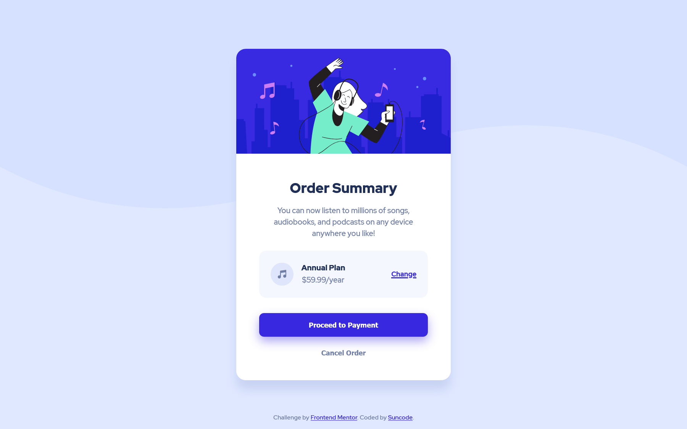

# Frontend Mentor - Order summary card solution

This is a solution to the [Order summary card challenge on Frontend Mentor](https://www.frontendmentor.io/challenges/order-summary-component-QlPmajDUj). Frontend Mentor challenges help you improve your coding skills by building realistic projects. 

## Table of contents

- [Overview](#overview)
  - [The challenge](#the-challenge)
  - [Screenshot](#screenshot)
  - [Links](#links)
- [My process](#my-process)
  - [Built with](#built-with)
  - [What I learned](#what-i-learned)
  - [Continued development](#continued-development)
  - [Useful resources](#useful-resources)
- [Author](#author)

## Overview

### The challenge

Users should be able to:

- See hover states for interactive elements

### Screenshot

### Links

- Solution URL: [GitHub](https://github.com/rizzok/fem-order-summary-component-main)
- Live Site URL: [Netlify](https://fem-order-summary-component-main.netlify.app/)

## My process

### Built with

- Semantic HTML5 markup
- CSS custom properties
- Flexbox
- Mobile-first workflow
- Sass

### What I learned

[Sass](https://sass-lang.com/)

### Useful resources

- [Grafikart's Sass videos](https://youtube.com/playlist?list=PLjwdMgw5TTLWVp8WUGheSrGnmEWIMk9H6)
- [Sass documentation](https://sass-lang.com/documentation)

## Author

- Website - [Kévin Rizzo](https://suncode.fr)
- Frontend Mentor - [@rizzok](https://www.frontendmentor.io/profile/rizzok)
- Twitter - [@rizzokdev](https://www.twitter.com/rizzokdev)
